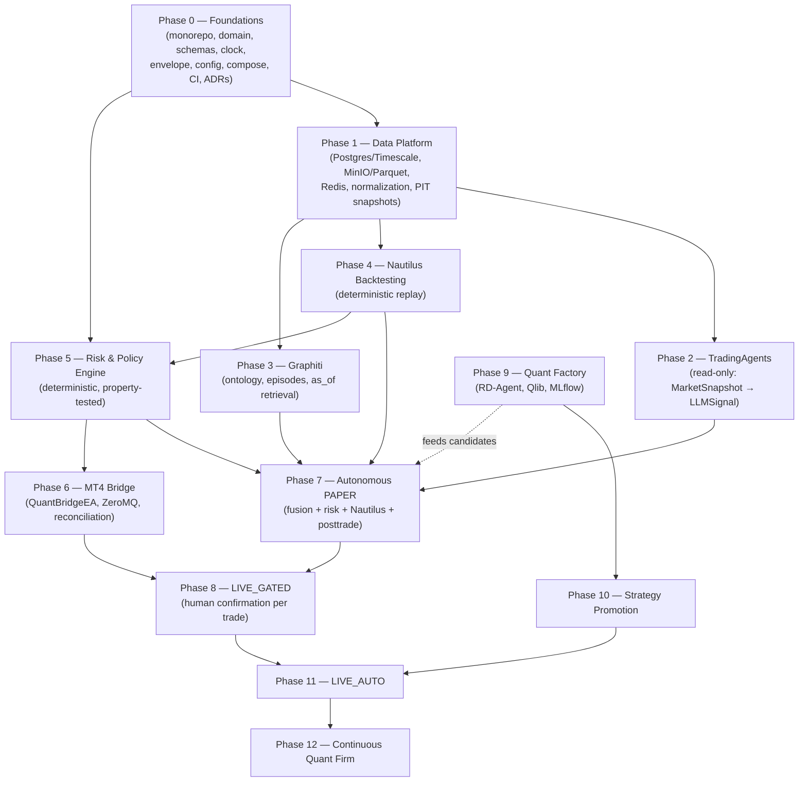

# Implementation Order — OpenTrading

- **Date:** 2026-08-26
- **Status:** plan + partial implementation. **Phases 0 and 1 are implemented**
  (see `PHASE0_FOUNDATIONS.md` and `PHASE1_DATA_PLATFORM.md`); Phases 2–12 are
  not started. (Definition of Done for the original planning task: "no major
  feature has been implemented yet" held at the time of writing.)
- **Source:** phases from `docs/architecture.md` §32, dependencies derived from §1–§31,
  invariants `.ai/rules/architecture-invariants.md`.

## 1. Guiding constraints

- Phase order respects the architecture's own roadmap (§32) and the dependency rules below.
- A phase may only start when the Definition of Done of all its dependencies holds
  (each DoD is cited from §32).
- PRE-00 prohibition stands: no trading functionality is implemented before Phase 0
  Foundations is complete and approved.
- INV-1 (intelligence ≠ authority over capital), INV-2 (`OrderIntent` canonical),
  INV-3 (point-in-time), INV-4 (deterministic risk) constrain every phase.

## 2. Implementation dependency graph

Key dependency rationale (all cross-referenced to the architecture):

- **P0 → everything.** Domain objects, event envelope, virtual clock and schemas are the
  substrate every adapter and engine plugs into (§15, §14, §12; Phase 0 DoD).
- **P1 → P2/P3/P4.** Agents, memory and backtests consume normalized point-in-time data
  (§12, §13; Phases 2–4 all take `MarketSnapshot`).
- **P3 depends on P1.** Graphiti episodes ingest market-derived entities; retrieval must
  honor `as_of` against the same clock (§11, §12).
- **P5 depends on P0 (+P4 for realistic inputs).** Risk Engine needs domain schemas and
  later validated position/fill semantics; it is independently testable with property
  tests as soon as schemas exist (§7, INV-4).
- **P7 (PAPER) is the first integration point:** it wires data + memory + TradingAgents +
  fusion + risk + Nautilus + postmortem (§32 Phase 7). P2/P3/P4/P5 all feed it.
- **P6 (MT4) is gated by P5:** only Risk-Engine-approved `OrderIntent`s may ever reach
  the bridge (INV-1, INV-2). Demo account first (§32 Phase 6).
- **P8 (LIVE_GATED) needs P7 + P6:** real execution requires a proven paper pipeline and
  a reconciled bridge.
- **P9 is deliberately late and parallel-leaning:** RD-Agent is "ADOPT OFFLINE" and can
  produce candidates early (dashed edge), but production impact is gated by P10 (§4, §18).
- **P10 → P11:** only promoted strategies may run LIVE_AUTO (INV-8); enabling requires an
  explicit, recorded administrative action.
- **P12** requires the full closed loop including degradation detection and postmortems.

## 3. Phase-by-phase order with deliverables and gates

| Order | Phase | Deliverables (architecture §32 + §27 layout) | DoD (§32, condensed) |
|---|---|---|---|
| 1 | 0 Foundations | monorepo; `core/domain`, `core/schemas`, `core/events`, `core/config`, `core/clock`, `core/audit`; `.env.example`, Makefile, Docker Compose skeleton, CI; ADRs | Domain imports nothing from TradingAgents/MT4/Qlib/Graphiti/Nautilus |
| 2 | 1 Data Platform | Postgres/Timescale; MinIO + Parquet catalog (`/raw`…`/gold`); Redis; `adapters/market_data`; `MarketSnapshot` PIT generation; data quality | Same dataset+timestamp → identical `MarketSnapshot`; stale data rejected |
| 3 | 2 TradingAgents | `adapters/tradingagents` (client, mapper, prompts, schemas, evaluator); `LLMSignal` | No code path from TradingAgents to MT4 |
| 4 | 3 Graphiti | ontology, episode ingestion, provenance, PIT retrieval API (`valid_at`) | Backtest at T never retrieves episodes after T |
| 5 | 4 Nautilus Backtesting | `adapters/nautilus`: `MarketSnapshot`/`Strategy`/`OrderIntent`/`ExecutionReport`; fees/slippage models | Deterministic replay (two runs, identical results) |
| 6 | 5 Risk & Policy | `engines/risk`: full control set, `RiskDecision` with `reason_codes`/`policy_version`; kill switches | Property/fuzz tests find no path over configured limits |
| 7 | 6 MT4 Bridge | `mt4/Experts/QuantBridgeEA.mq4`, `adapters/mt4`, ZeroMQ gateway, heartbeat, symbol mapping, protocol, reconciliation; demo account | 100× same `order_intent_id` → never more than one trade |
| 8 | 7 Autonomous PAPER | `engines/signal_fusion`, `engines/posttrade`; wire data+memory+agents+quant+risk+Nautilus | End-to-end paper, no human; recovers from restarts |
| 9 | 8 LIVE_GATED | real MT4; confirmation flow (`APPROVED BY RISK → WAITING_FOR_HUMAN → EXECUTION`) | Disconnect/restart/duplicate/rejection/partial fills/unexpected positions tested |
| 10 | 9 Quant Factory | `services/quant-rd` (Py 3.11); `adapters/qlib`, `adapters/rdagent`; MLflow; candidate generation | Reproducible `StrategyCandidate`s; cannot modify production |
| 11 | 10 Strategy Promotion | `engines/promotion`; candidate → robustness → paper → shadow → live-gated | Every promotion: evidence, metrics, code SHA, data hash, config version, approval |
| 12 | 11 LIVE_AUTO | promoted strategies only; administrative enable action | Enablement is explicit, recorded, and impossible for an LLM |
| 13 | 12 Continuous Quant Firm | continuous research, degradation detection, postmortems, candidate replacement, allocation recommendations | Research runs continuously; production remains governed |

## 4. Cross-cutting workstreams (interleaved, not phases)

| Stream | When | Notes |
|---|---|---|
| Testing | From Phase 0 continuously | unit + property-based (Risk) + integration (mocks/emulators) + replay + leakage + chaos (§30, DoD) |
| Observability | Langfuse from Phase 2; Prometheus/Grafana from Phase 1 | `trace_id` end-to-end (§22, §23, §31) |
| Security | Threat model doc before Phase 6; secrets store with first credentials | §29, trust zones |
| Docs & ADRs | Every phase | ADR required before any deviation from frozen decisions (INV-12) |
| Graphify | Continuously | `graphify update .` after structural changes; dev-context only (INV-11) |

## 5. Immediate next actions (still non-feature)

1. Approve this plan and the 16 ADRs (Principal Architect review per
   `.ai/workflows/adr-workflow.md`).
2. Close documentation-level gaps listed in `GAP_ANALYSIS.md` §2
   (`docs/threat-model/` before Phase 6; runbooks/protocols with Phases 5–6).
3. Begin Phase 0 Foundations — the only sanctioned starting point.

---

*Status log*: Phases 0–5 and 7 completed; Phase 6 (MT4 bridge) completed with
the protocol/emulator (ADR-0020/0021). Phase 7 (Autonomous PAPER) completed
2026-08-27 — see `docs/architecture/PHASE7_AUTONOMOUS_PAPER.md` and ADR-0022.
Next: Phase 8 (LIVE_GATED) gated on a reconciled MT4 bridge.
