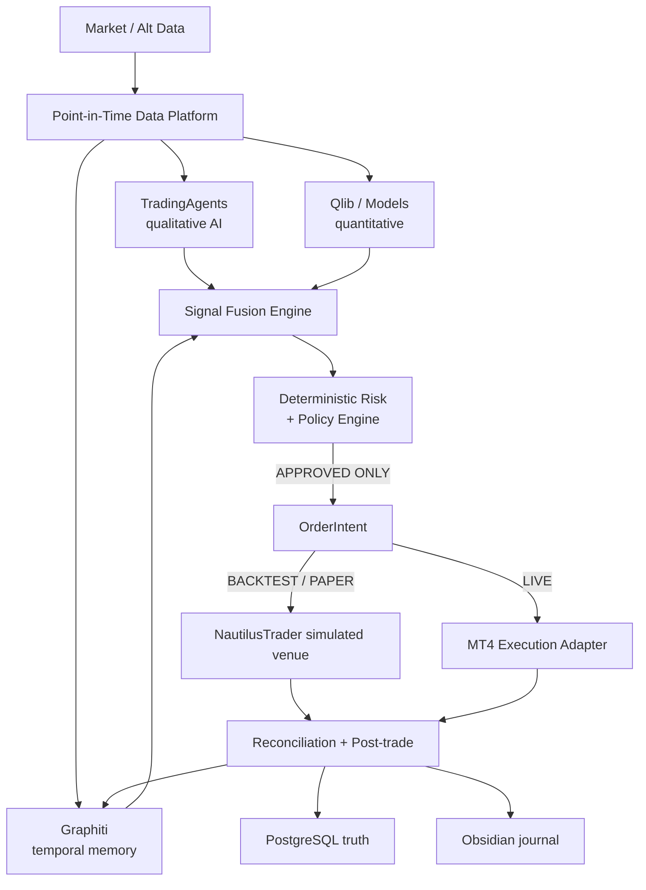

# Target Architecture — Autonomous Quantitative Trading & Research Platform

- **Canonical source:** `docs/architecture.md` v1.0 (2026-08-26, Spanish, §1–§35).
  That document is authoritative; this file is the English reference condensation and
  must never drift from it.
- **Audit date:** 2026-08-26
- **Goal:** a personal, autonomous, auditable, evolvable quantitative firm: research
  strategies, validate them, paper-trade, and finally execute via MetaTrader 4 —
  without granting any LLM direct control over capital.

## 1. Absolute rule

> **LLMs research, argue and propose. Deterministic code decides whether a trade may execute.**

This is INV-1 and is stated as non-modifiable ("Esto no se modificará posteriormente", §1).

## 2. System data flow



## 3. Component decisions (frozen)

| Component | Decision | Definitive role |
|---|---|---|
| TauricResearch/TradingAgents | ADOPT | Multi-agent qualitative analysis committee (behind an adapter) |
| LangGraph | ADOPT | Internal orchestration of TradingAgents / some workflows |
| Microsoft Qlib | ADOPT | Quantitative research, ML, factors, evaluation, experiments |
| Microsoft RD-Agent | ADOPT OFFLINE | Autonomous factor/model/hypothesis R&D factory |
| NautilusTrader | ADOPT | Event-driven engine: backtesting + paper trading |
| Graphiti | ADOPT | Temporal semantic memory of the system |
| FinMem | EXTRACT IDEAS | Memory layers, importance, reflection — concepts only |
| Graphify | ADOPT DEV-ONLY | Code graph + context reduction for development |
| Obsidian | ADOPT | Human knowledge base + trading journal |
| DWX / ZeroMQ MT4 projects | REFERENCE | MT4 bridge design reference only |
| MQL4 `WebRequest` | REJECT as transport | Synchronous, blocking, unavailable in Strategy Tester |
| Kafka/Redpanda | LATER | Redis Streams is sufficient initially |
| Kubernetes | LATER | Docker Compose first |

## 4. Runtimes (INV-13 — never merged)

- **Core runtime — Python 3.12:** TradingAgents, Graphiti adapters, Nautilus, FastAPI,
  Risk Engine, workers, execution gateway.
- **Quant R&D — Python 3.11, Linux:** RD-Agent, Qlib, MLflow, research environments.

## 5. Operating modes (INV-8 — only these five)

`RESEARCH` → `BACKTEST` → `PAPER` → `LIVE_GATED` → `LIVE_AUTO`

- RESEARCH: no orders possible.
- BACKTEST: virtual clock; every external source must satisfy
  `source_timestamp <= simulation_timestamp`.
- PAPER: live data, simulated orders; full pipeline except broker transmission.
- LIVE_GATED: full pipeline + human confirmation per trade
  (`APPROVED BY RISK → WAITING_FOR_HUMAN → EXECUTION`).
- LIVE_AUTO: only promoted strategies; **no LLM may change the operating mode**.

## 6. Risk Engine — the most important component (INV-1, INV-4)

100% own deterministic code. No LLM, no agent, no prompt, no probabilistic interpretation.

```text
TradeProposal → Policy Engine → Risk Engine → APPROVE / REJECT
```

- Inputs: NAV, equity, free margin, positions, pending orders, price, spread,
  volatility, correlations, liquidity, proposed stop, instrument rules, strategy/portfolio
  risk budgets, daily PnL, drawdown, quote freshness, heartbeat, reconciliation state.
- Controls: per-trade risk, total/per-instrument/per-asset-class/per-currency exposure,
  correlated clusters, leverage, simultaneous orders/positions, daily loss, rolling
  drawdown, spread/slippage caps, stop minimums, size min/max, lot step, margin, turnover,
  loss-sequence cooldown, trading hours, event restrictions, strategy active, symbol
  whitelist, broker connected, heartbeat, reconciliation.
- Output is never a bare `{"approved": true}`:
  - `REJECT` → `{"decision": "REJECT", "reason_codes": ["MAX_DAILY_LOSS_REACHED", ...]}`
  - `APPROVE` → `{"decision": "APPROVE", "approved_quantity": 0.18,
    "approved_stop": 1.08271, "risk_amount": 94.20, "policy_version": "risk-17"}`

## 7. MT4 as execution-only layer (INV-5)

`mt4/Experts/QuantBridgeEA.mq4` — a deliberately minimal EA:

```text
Receive command → Validate command → Broker validation → Send order → Return execution event
```

- Transport: private ZeroMQ (or equivalent private IPC/network), WireGuard to a Windows
  MT4 host; never internet-exposed. MQL4 `WebRequest` rejected (blocking, no Strategy
  Tester support).
- Channels: MT4→Core (`PUB quotes`, `PUSH execution events`, `PUSH account snapshots`,
  `PUSH heartbeat`); Core→MT4 (`REQ order`, `REQ cancel`, `REQ modify`,
  `REQ account reconciliation`).
- Message fields: `protocol_version`, `trace_id`, `order_intent_id`, `strategy_id`,
  `strategy_version`, `symbol`, `side`, `quantity`, `order_type`, `price`, `stop_loss`,
  `take_profit`, `max_slippage`, `timestamp`, `sequence`, `checksum`.
- EA-side defense-in-depth even if the backend is compromised: trading enabled, symbol
  whitelist, lot limit/step, spread limit, free margin, quote freshness, market open,
  stop/freeze level, duplicate `order_intent_id`, MagicNumber, command expiry.

## 8. Reconciliation, kill switches, dead-man (INV-6, INV-7)

- Order state machine: `CANDIDATE → RISK_REJECTED → APPROVED → ORDER_INTENT → SUBMITTED →
  ACKNOWLEDGED → PARTIALLY_FILLED → FILLED → CANCELLED → REJECTED → RECONCILED → CLOSED →
  REVIEWED`.
- Never assume `send_order() == executed_trade`. Every restart: DB state vs broker state →
  `RECONCILE`; divergence → `SAFE_MODE`, new entries blocked.
- Kill levels: strategy, instrument, portfolio (`NO_NEW_POSITIONS`), emergency
  (`CANCEL_PENDING` + `NO_NEW_POSITIONS` + optionally flatten), dead-man (heartbeat loss →
  broker SL/TP remain, new trades BLOCKED; no automatic liquidation without explicit policy).

## 9. Memory: Graphiti + FinMem concepts (INV-11)

Graphiti builds temporal context graphs: entities, relations, temporal validity, history,
original episodes, provenance, hybrid search. Backend starts on FalkorDB; Neo4j only with
clear operational reason.

- Ontology entities: `Instrument`, `Company`, `Sector`, `Currency`, `MacroEvent`,
  `NewsEvent`, `Thesis`, `Signal`, `MarketRegime`, `Strategy`, `Factor`, `Model`,
  `Experiment`, `Trade`, `Position`, `RiskEvent`, `DataSource`.
- Relations: `SUPPORTS`, `CONTRADICTS`, `INVALIDATES`, `GENERATED_BY`, `CAUSED_BY`,
  `CORRELATES_WITH`, `ACTIVE_IN_REGIME`, `FAILED_IN_REGIME`, `EXECUTED_AS`, `RESULTED_IN`,
  `LEARNED_FROM`.
- Three layers (FinMem concepts, not its runtime): short-term (hours/days), medium-term
  (weeks/months: regimes, patterns, calibration), long-term (postmortems, failure modes,
  structural lessons).

## 10. Point-in-Time rule (INV-3)

At simulated time T, nothing posterior to T may be visible: prices, results, news, macro
revisions, memory, embeddings, postmortems, knowledge graph. Every query carries `as_of`;
Graphiti exposes `memory.query(query=..., valid_at=simulation_clock.now())`. The knowledge
graph is never preloaded with the full dataset (look-ahead leakage). Leakage tests fail
the build on violation.

## 11. Data architecture (INV-10)

| Store | Responsibility |
|---|---|
| PostgreSQL + TimescaleDB | Transactional source of truth: accounts, strategies, strategy_versions, risk_policies, signals, trade_proposals, risk_decisions, order_intents, broker_orders, executions, positions, trades, portfolio_snapshots, system_events, audit_events, promotion_decisions |
| Parquet + MinIO | Heavy history: ticks, bars, fundamentals, macro, news, features, model datasets, backtest results, artifacts — `/raw`, `/bronze`, `/silver`, `/gold` |
| Redis | Cache, locks, rate limits, ephemeral state, worker coordination, **Redis Streams** |
| FalkorDB + Graphiti | Temporal semantic memory |
| MLflow | Experiment tracking (Qlib-native abstraction; no custom system) |

## 12. Event bus (INV-15)

Redis Streams initially; Kafka/Redpanda later. Event names include
`market.snapshot.created`, `research.*`, `quant.signal.created`, `llm.signal.created`,
`signal.fused`, `risk.approved/rejected`, `order.intent.created` … `order.rejected`,
`position.updated`, `trade.closed`, `postmortem.completed`, `memory.episode.created`,
`strategy.candidate.created/promoted/retired`, `system.safe_mode.entered/exited`.
Experiment lifecycle records use `experiment.created/completed`; these events also feed
the non-authoritative Obsidian mirror.

Standard envelope: `schema_version`, `event_id` (UUID), `trace_id` (UUID), `event_time`,
`ingested_at`, `producer`, `payload`, `provenance`.

## 13. Canonical domain objects (INV-2)

`Instrument`, `MarketSnapshot`, `ResearchPacket`, `QuantSignal`, `LLMSignal`,
`FusedSignal`, `TradeProposal`, `RiskDecision`, `OrderIntent`, `ExecutionReport`,
`PositionSnapshot`, `TradeOutcome`, `PostTradeReview`, `MemoryEpisode`, `FactorCandidate`,
`ModelCandidate`, `StrategyCandidate`, `ExperimentRun`, `PromotionDecision`.

`OrderIntent` is the only object that crosses the system (never `MT4Order`), so
TradingAgents, Nautilus, Graphiti, and MT4 are each replaceable without rebuilding the app,
and backtest/paper/live never diverge into three implementations.

## 14. Signal Fusion (INV-16)

Fusion of quant, LLM, regime and memory inputs into `FusedSignal`. Weights
(e.g. 0.30 LLM / 0.50 Quant / 0.20 Regime) are **not arbitrary** — they derive from
historical validation and calibration. Always compare Quant-only / LLM-only /
Quant+LLM / simple baseline. If the LLM adds no post-cost alpha, its weight is reduced or
removed.

## 15. Post-trade learning loop

Closed trade → execution analysis → attribution → LLM thesis eval → quant signal eval →
risk eval → postmortem → Graphiti episode → strategy statistics. Metrics: PnL, R multiple,
alpha, slippage, fees, MAE, MFE, time in trade, entry/exit efficiency, calibration,
prediction error, regime. Memory learns from the gap between **Expected vs Actual**.

## 16. Strategy lifecycle (INV-8)

```text
IDEA → CANDIDATE → BACKTESTED → WALK_FORWARD_OK → ROBUSTNESS_OK → PAPER → SHADOW →
LIVE_GATED → LIVE_AUTO → RETIRED
```

There is **no** `RD-Agent → LIVE` edge. Validation Factory: costs included, out-of-sample,
walk-forward, purged/embargo, Monte Carlo, regime testing, sensitivity, multiple-testing
protection (all experiments logged, including failed ones). Mandatory metrics: performance
(CAGR, Sharpe, Sortino, Calmar, MDD, recovery/profit factor, expectancy, win rate, tails),
portfolio (gross/net exposure, leverage, turnover, concentration, correlation), trade
(MAE, MFE, slippage, holding, entry/exit efficiency), quant (IC, RankIC, stability, decay,
calibration), model (drift, feature/prediction/calibration drift).

## 17. LLM evaluation

Historical dataset of `MarketSnapshot` + known-info `as_of T`; evaluate schema compliance,
tool usage, grounding, unsupported claims, decision stability, confidence calibration,
cost, latency, provider variance; same scenario across seeds/models/providers — direction
must not flip chaotically.

## 18. Observability

- **Langfuse** (AI): prompts, responses, models, costs, latency, tools, retrieval, traces.
  A real trade must be fully reconstructable months later (full trace from MarketSnapshot
  through RiskDecision, OrderIntent, Execution).
- **Prometheus + Grafana** (ops/trading): MT4 heartbeat, execution/broker latency, queue
  lag, data freshness, LLM errors/cost, agent duration, NAV, equity, PnL, drawdown, risk
  utilization, exposure, spread, slippage, fills, rejects. Alerts: missing heartbeat, stale
  data, broker disconnected, unexpected position, drawdown/daily-loss thresholds, rejection
  spikes, provider/Redis/DB failures.
- Every operation carries `trace_id` across MarketSnapshot → TradingAgents → Graphiti →
  Qlib → FusedSignal → RiskDecision → OrderIntent → MT4 → ExecutionReport → Trade →
  Postmortem → Obsidian → Langfuse.

## 19. Development tooling (INV-11)

- **Graphify** = codebase knowledge graph for development context only
  (`graphify-out/graph.json`, wiki, GRAPH_REPORT; post-commit hook updates). It is
  **never** runtime, never financial memory.
- **Obsidian** = human knowledge UI: `vault-trading/` (00_System … 90_Auto, per-trade
  notes with frontmatter and Thesis/Signals/Risk decision/Execution/Outcome/What
  worked/What failed/Lesson) + `vault-code/`. Autogenerated content is marked as such.
  No secrets.
- **Command Center** = TypeScript web UI (§26): Overview, Research, Signals, Risk,
  Orders & Trades, Memory, Backtests, Agents, System. No trading logic client-side.

## 20. Security (INV-9)

Three trust zones — Zone 1: internet/LLM/market data; Zone 2: Core Quant Platform;
Zone 3: broker/MT4. LLMs never hold broker credentials, MT4 credentials, execution
sockets, or secret-store access. Dev secrets: `.env`; prod: SOPS+age or Vault/Docker
secrets. ZeroMQ sockets never exposed to the internet (WireGuard to MT4).

## 21. Dependencies (INV-14)

No full upstream repos copied in. `external-lock.yaml` pins project, repository, tag,
commit SHA, license, last reviewed. Production never follows `main`/`latest`/`HEAD`.
Licenses: TradingAgents Apache-2.0; Qlib MIT; NautilusTrader LGPL-3.0 (independent
dependency, code never copied into core).

## 22. Testing strategy

Unit (Risk Engine, sizing, symbol mapping, state machine, protocol validation);
property-based (`risk > limit → NEVER APPROVE`, duplicate `order_intent_id → NEVER SECOND
ORDER`, `approved lot <= configured max`); integration (TradingAgents mock, Graphiti,
Redis, Postgres, Nautilus, MT4 emulator); replay (exact market-day reproduction); leakage
(fail if anything reads `timestamp > virtual_clock`); chaos (Redis death, Postgres
restart, MT4 disconnect, network cut, crash after submit/before ACK, duplicate/out-of-order
fills → system reconstructs state).

## 23. Target repository layout (§27)

```text
apps/{api,worker,command-center}
core/{domain,schemas,events,config,clock,audit}
engines/{signal_fusion,risk,portfolio,posttrade,promotion}
adapters/{tradingagents,graphiti,nautilus,qlib,rdagent,market_data,mt4}
services/{core-runtime(Py3.12),quant-rd(Py3.11 Linux)}
mt4/{Experts/QuantBridgeEA.mq4,Include,protocol,tests}
research/{factors,models,strategies,baselines,notebooks}
data/{schemas,catalogs,fixtures}
prompts/{analysts,researchers,trader,evaluators}
infra/compose/{postgres,redis,falkordb,minio,mlflow,langfuse,prometheus,grafana}
vault-trading/
tests/{unit,integration,replay,leakage,backtest,execution,risk,security,chaos}
docs/{architecture,ADR,threat-model,runbooks,protocols}
graphify-out/
README.md  Makefile  .env.example
```

## 24. Roadmap (Phases 0–12, §32)

| Phase | Deliverable | Definition of Done (core) |
|---|---|---|
| 0 Foundations | monorepo, domain model, Pydantic schemas, virtual clock, event envelope, config, compose, CI, ADRs | Domain imports nothing from TradingAgents/MT4/Qlib/Graphiti/Nautilus |
| 1 Data Platform | Postgres/Timescale, MinIO, Parquet catalog, Redis, normalization, PIT snapshots, data quality | Same dataset+timestamp → identical `MarketSnapshot`; stale data rejected |
| 2 TradingAgents | Read-only integration: `MarketSnapshot → TradingAgents → LLMSignal` | No code path from TradingAgents to MT4 |
| 3 Graphiti | Ontology, episode ingestion, PIT queries, provenance, retrieval API | Backtest at T never retrieves episodes after T |
| 4 Nautilus Backtesting | `MarketSnapshot/Strategy/OrderIntent/ExecutionReport` adapter | Same backtest twice → deterministic results |
| 5 Risk & Policy Engine | Full rule set | Property/fuzz tests find no path over configured limits |
| 6 MT4 Bridge | QuantBridgeEA.mq4, ZeroMQ gateway, heartbeat, symbol mapping, commands, fills, reconciliation; demo account first | 100× same `order_intent_id` → never more than one trade |
| 7 Autonomous PAPER | data + memory + agents + quant + fusion + risk + Nautilus + postmortem | End-to-end paper without humans; recovers from restarts |
| 8 LIVE_GATED | Real MT4; human confirmation per trade | Disconnect/restart/duplicate/rejection/partial fill/unexpected position tested |
| 9 Quant Factory | RD-Agent, Qlib, MLflow, factor/model factories, candidates | Reproducible `StrategyCandidate`s; cannot modify production |
| 10 Strategy Promotion | candidate → robustness → paper → shadow → live gated | Every promotion has evidence, metrics, code SHA, data hash, config version, approval |
| 11 LIVE_AUTO | Promoted strategies only | Enabling requires explicit administrative action, recorded; no LLM can do it |
| 12 Continuous Quant Firm | Continuous research, degradation detection, postmortems, candidate replacement, capital allocation recommendations | Research runs continuously; production stays governed |

## 25. V1 definition (§33)

Point-in-time market data · TradingAgents · Graphiti memory · quant signal interface ·
Signal Fusion · deterministic Risk Engine · Nautilus backtesting · Nautilus paper ·
MT4 bridge · reconciliation · PostgreSQL audit trail · post-trade analysis · Obsidian
journal · Langfuse · Grafana · Command Center · promotion lifecycle · safe mode ·
kill switch. RD-Agent enters immediately after as the second autonomy layer.

## 26. Frozen decisions (§34)

1. Python = quantitative backend language. 2. TypeScript = Command Center. 3. MQL4 only
in the Execution Bridge. 4. TradingAgents = LLM committee. 5. Qlib = quant platform.
6. RD-Agent = autonomous R&D factory. 7. Nautilus = event-driven/backtest/paper engine.
8. Graphiti = temporal memory. 9. FinMem = inspiration only. 10. Graphify = dev context
only. 11. Obsidian = human knowledge UI. 12. PostgreSQL = transactional truth.
13. Parquet/MinIO = heavy history. 14. Redis Streams = initial bus. 15. Langfuse = agent
observability. 16. Prometheus/Grafana = ops observability. 17. MT4 = execution venue, not
brain. 18. Private ZeroMQ = MT4 transport. 19. LLMs never control sizing/capital.
20. Research never auto-promotes to real money.

Each is documented in `docs/ADR/` (see index).

## 27. Operating principle (§35)

```text
OBSERVE → REMEMBER → RESEARCH → MODEL → DEBATE → PROPOSE → VALIDATE →
CONTROL RISK → EXECUTE → RECONCILE → MEASURE → LEARN → EVOLVE ↺
```

with an insurmountable barrier between **INTELLIGENCE** and **AUTHORITY OVER CAPITAL**.
