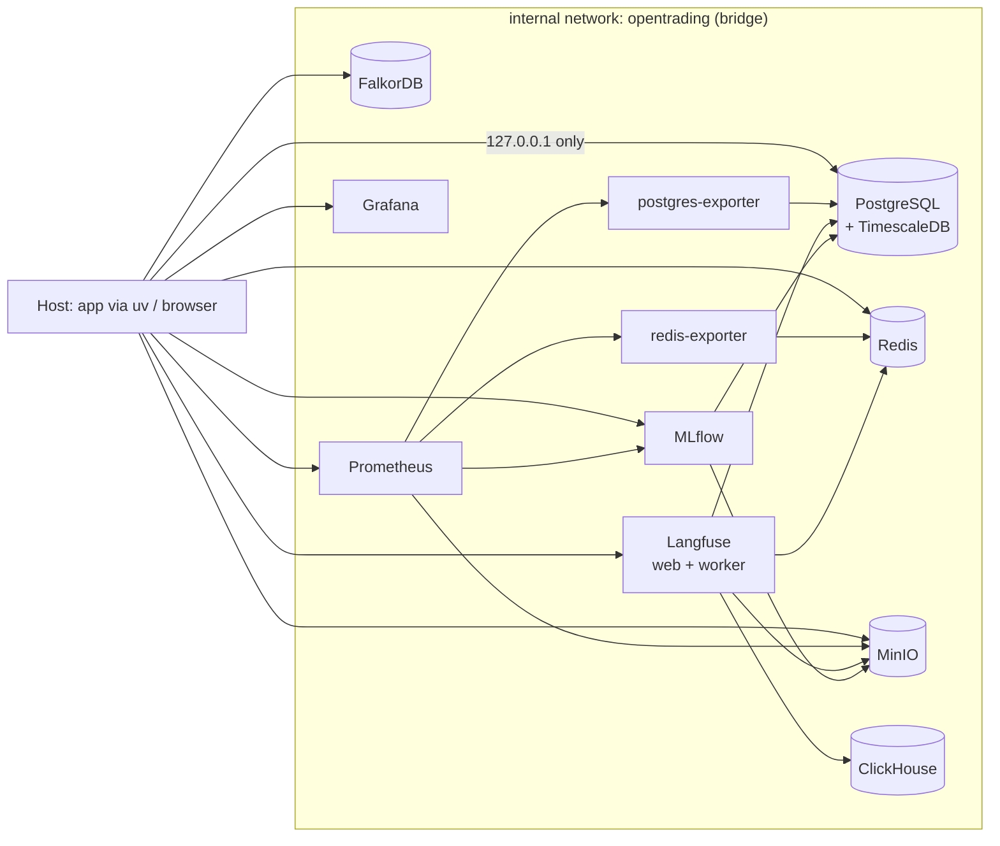

# Runbook — Infrastructure

How the OpenTrading local infrastructure is composed, configured, secured and
operated. Canonical decisions: `docs/architecture.md` §13 (data architecture),
§22 (Langfuse), §23 (Prometheus/Grafana), §27 (repo layout), §29 (security);
ADRs `docs/ADR/` (notably ADR-0025 security hardening); threat model
`docs/threat-model/threat-model.md`; invariants `.ai/rules/architecture-invariants.md`
(INV-9 secrets, INV-10 storage split, INV-14 pinned dependencies).

## Architecture



Every service joins the internal `opentrading` bridge network and reaches
siblings by DNS name (`postgres`, `redis`, `minio`, …). Host traffic enters
only through `127.0.0.1`-bound port mappings declared in the dev compose file.

## Files

```text
infra/
├── compose/
│   ├── docker-compose.yml        # dev stack (complete, ports on 127.0.0.1)
│   └── docker-compose.prod.yml   # prod overrides (merged on top)
├── postgres/init/001-init.sh     # first-boot: extension + sidecar databases
├── prometheus/prometheus.yml     # scrape config (dev)
├── grafana/provisioning/         # Prometheus datasource + dashboard provider
├── grafana/dashboards/           # "OpenTrading Infrastructure" dashboard
├── mlflow/Dockerfile             # pinned MLflow + psycopg2/boto3 drivers
└── <service>/README.md           # one page per service

migrations/                       # Alembic (repo root, backend-platform owns)
├── env.py                        # DSN from OT_POSTGRES_DSN
└── versions/0001_platform_primitives.py
```

## Services

| Service | Image (pinned) | State volume | Host port (dev) |
|---|---|---|---|
| PostgreSQL + TimescaleDB | `timescale/timescaledb:2.29.2-pg16` | `postgres-data` | 5432 |
| Redis | `redis:7.4-alpine` | `redis-data` | 6379 |
| MinIO | `minio/minio:RELEASE.2025-09-07T16-13-09Z` | `minio-data` | 9000/9001 |
| MinIO bucket bootstrap | `minio/mc:RELEASE.2025-08-13T08-35-41Z` | — | — |
| FalkorDB | `falkordb/falkordb:v4.20.4-alpine` | `falkordb-data` | 6380→6379 |
| ClickHouse (Langfuse) | `clickhouse/clickhouse-server:25.12.11` | `clickhouse-data` | 8123 |
| Langfuse web / worker | `docker.langfuse.com/langfuse/langfuse{,-worker}:v4.19.0` | (platform Postgres/Redis/MinIO) | 3000 |
| MLflow | `opentrading/mlflow:v3.8.1` (built from `ghcr.io/mlflow/mlflow:v3.8.1`) | (Postgres + MinIO) | 5000 |
| Prometheus | `prom/prometheus:v3.14.0` | `prometheus-data` | 9090 |
| Grafana | `grafana/grafana:13.0.7` | `grafana-data` | 3001→3000 |
| postgres-exporter | `prometheuscommunity/postgres-exporter:v0.20.1` | — | internal |
| redis-exporter | `oliver006/redis_exporter:v1.89.0-alpine` | — | internal |

Pins are recorded in `external-lock.yaml` (INV-14: production never follows
`main`/`latest`; exact patch versions only).

## Storage layout (INV-10)

- **PostgreSQL** — transactional source of truth. Platform database
  `opentrading` (TimescaleDB enabled) plus dedicated sidecar databases
  `mlflow` and `langfuse`. Business tables arrive per phase through Alembic;
  migration `0001` creates only platform primitives: `system_events`
  (hypertable) and `audit_events`.
- **MinIO** — large datasets/artifacts. Buckets: `raw`, `bronze`, `silver`,
  `gold` (parquet medallion layout, §13) and `mlflow-artifacts`, `langfuse`.
- **Redis** — cache, locks, rate limits, streams (§14 event bus).
- **FalkorDB** — graph store for temporal trading memory (Graphiti, Phase 3).
- **ClickHouse** — Langfuse analytics backend only; not a platform store.

## Health checks

Every service defines a Docker `healthcheck`; `make up` uses
`up --wait`, so the command returns only when the whole stack is green.

| Service | Probe |
|---|---|
| postgres | `pg_isready` |
| redis | `redis-cli … ping` (authenticated) |
| minio | `curl /minio/health/live` |
| falkordb | `redis-cli ping` |
| clickhouse | `wget /ping` |
| langfuse-web | HTTP `/api/public/health` (fallback `/`) |
| langfuse-worker | process liveness (`pgrep node`) |
| mlflow | Python `urlopen /health` |
| prometheus | `wget /-/ready` |
| grafana | `wget /api/health` |
| postgres-exporter / redis-exporter | HTTP metrics endpoint |

Application level: `GET /readyz` (FastAPI) probes PostgreSQL, Redis, MinIO and
FalkorDB with a configurable timeout and reports per-dependency latency;
`GET /healthz` is process liveness. See `docs/runbooks/local-development.md`.

## Secrets policy (INV-9, §29, ADR-0025)

- Only `.env.example` is committed. `.env`, `.env.*` and `secrets/` are
  git-ignored (`git check-ignore .env` must succeed).
- Dev credentials are placeholder defaults baked into the compose file
  (`opentrading-dev`) — they are for local development only.
- **Production secrets live only in `secrets/*.env`, encrypted with SOPS + age**
  (`.sops.yaml`, `scripts/secrets/*`); see `docs/runbooks/secrets-management.md`.
- **Production fails closed**: `docker-compose.prod.yml` replaces every secret
  with `${VAR:?message}` interpolation — starting the prod profile without a
  secret aborts before any container runs.
- Generate prod secrets with `openssl rand -hex 32`. Production secrets in this
  repo's scope are runtime passwords only; broker credentials stay outside the
  platform entirely (§29).
- Logs are redacted (`core/security/redact.py`) so secrets never reach them.

## Development vs production

```bash
# Development (ports on 127.0.0.1, dev passwords, no auto-restart)
make up

# Production profile (merged override)
# Secrets come from the SOPS-encrypted env file — see
# docs/runbooks/secrets-management.md for decrypt + start.
docker compose --project-name opentrading-prod \
  -f infra/compose/docker-compose.yml \
  -f infra/compose/docker-compose.prod.yml \
  --env-file <transient-plaintext-env> up -d --build --wait
```

Production differences:

1. **No published ports** (`ports: !reset []`) — all services internal-only;
   expose via a reverse proxy/VPN in front of the host.
2. **Internal-only network** (`networks.opentrading.internal: true`) — no
   container path to the host or the internet; the Core ↔ MT4 ZeroMQ exec plane
   exists only inside the WireGuard tunnel (`infra/wireguard/README.md`).
3. **`restart: unless-stopped`** and bounded json-file logging
   (10 MB × 3 files per container).
4. **Secrets required** (fail-closed interpolation).
5. **Least privilege everywhere** (ADR-0025): Postgres roles
   (`ot_migrator`/`ot_app`/`ot_readonly`/`langfuse`/`mlflow`), Redis ACL users,
   MinIO scoped users, FalkorDB `requirepass`, Langfuse telemetry off.
6. Separate volume namespace via `--project-name opentrading-prod`.

Requires Docker Compose ≥ 2.24 (`!reset` tag support).

## Security hardening (ADR-0025)

- Postgres: roles are created by `infra/postgres/init/002-roles.sh` on **first
  volume init**. If a dev volume predates this milestone, run `make reset-dev`
  once to bootstrap the roles (existing business tables are re-granted to
  `ot_app`/`ot_readonly` by the same script).
- Redis: prod startup writes an ACL file (`infra/redis/entrypoint-acl.sh`);
  `default` is off, apps use the `opentrading` user without
  `@admin/@dangerous/@scripting`, exporters use `redis-exporter`.
- MinIO: `minio-init` creates buckets plus scoped users (`platform`, `langfuse`,
  `mlflow`) with per-bucket policies (`infra/minio/policies/*.json`); the root
  credentials are admin-only. The web console is off in prod.
- CI: gitleaks + pip-audit on every push (`.github/workflows/ci.yml`).
- Threat model and controls: `docs/threat-model/threat-model.md`.

## Migrations

```bash
make migrate          # alembic upgrade head
make migrate-down     # alembic downgrade -1
uv run alembic revision -m "describe change"   # new revision
```

- DSN comes from `OT_POSTGRES_DSN` (default dev DSN matches the compose stack);
  production sets `OT_POSTGRES_MIGRATOR_DSN` to the DDL-capable `ot_migrator`
  role while the app runs as the DML-only `ot_app` role (ADR-0025).
- `backend-platform` owns migrations; domain schema changes additionally
  require `principal-architect` / `market-data` review (`.ai/agents/`).
- Run migrations **after** the stack is healthy; the migration user must be
  able to create extensions (the dev `POSTGRES_USER` is a superuser; in
  production `ot_migrator` owns `public` while `ot_app` gets DML-only grants).

## Observability

- Prometheus scrapes: itself, postgres-exporter, redis-exporter, MinIO cluster
  metrics, MLflow — over the internal network.
- Grafana provisions the Prometheus datasource and the
  **OpenTrading Infrastructure** dashboard (uptime panels, Redis memory,
  PostgreSQL connections).
- FalkorDB has no native metrics endpoint yet; add an exporter when Phase 3
  lands. Langfuse emits OTel — wire the OTLP endpoint into Prometheus when
  Phase 2 observability starts.

## Backups (operational notes)

- Named volumes are the only state. Dev: `make reset-dev` destroys them.
- Production back up: `docker run --rm --volumes-from <postgres> … pg_dump`,
  plus `mc mirror` of the MinIO buckets; automate in the deployment phase
  (out of scope for this local-infra milestone).

## Definition of Done (this milestone)

1. `make up` starts the complete environment — ✅ single command.
2. Health checks green for every service — ✅ compose healthchecks + `make health`.
3. Persistent storage — ✅ named volumes for all stateful services.
4. No credentials committed — ✅ only `.env.example` with dev placeholders.
5. Integration smoke tests — ✅ `make test-integration`
   (`tests/integration/test_infra_smoke.py`) gates on a live stack.
