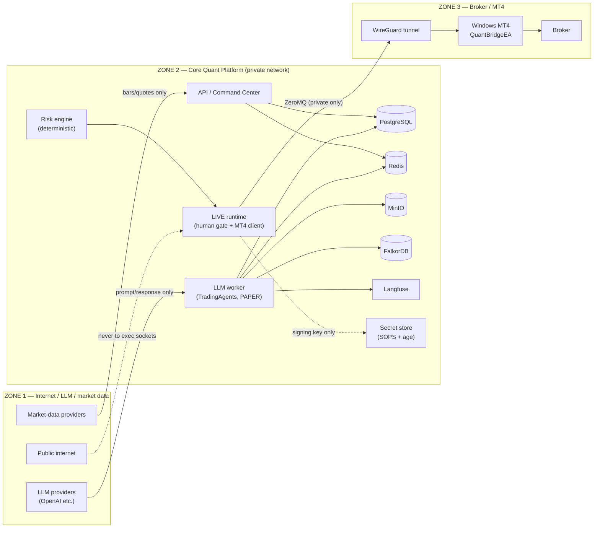

# OpenTrading — Threat Model

Status: **accepted** (security hardening milestone, ADR-0025)
Scope: Core Quant Platform (Zone 2) and its boundaries to the Internet/LLM/market-data
zone (Zone 1) and the broker/MT4 zone (Zone 3). Trust-zone split is canonical in
`docs/architecture.md` §29 and invariant INV-9.

This document is the authoritative threat-model register for the platform. Every listed
control is traceable to code, tests, compose configuration, or CI.

## 1. Trust zones

| Zone | Contains | Trust level |
|---|---|---|
| Zone 1 | Internet, LLM providers, market-data providers, Langfuse cloud (if used) | **Untrusted.** Output is advisory-only data. |
| Zone 2 | Core Quant Platform: API, worker, risk, execution runtime, all data stores | Trusted infrastructure; **internal processes are compartmentalized** (least privilege). |
| Zone 3 | MT4 terminal, broker, Windows host | Semi-trusted remote endpoint. Reached only over a private WireGuard tunnel; ZeroMQ never touches the public internet. |

## 2. Assets

| Asset | Location | Confidentiality | Integrity | Availability | Impact if lost |
|---|---|---|---|---|---|
| Broker account / credentials | Outside platform (§29); MT4 side only | Critical | Critical | High | Capital loss |
| Execution capability (the ability to submit broker orders) | `engines/execution/*`, `adapters/mt4/*` | Critical | Critical | High | Capital loss |
| Live approval signing key `OT_LIVE_APPROVAL_SIGNING_KEY` | Secret store (SOPS) | Critical | Critical | Medium | Bypass of human gate |
| Operator token `OT_LIVE_OPERATOR_TOKEN` | Secret store (SOPS) | Critical | Critical | Medium | Unauthorized approvals/kill-switch changes |
| PostgreSQL (transactional truth, audit log) | Zone 2 | High | Critical | High | Tampered ledger, hidden orders |
| Redis (streams, locks, event bus) | Zone 2 | Medium | High | Medium | Event forgery, queue poisoning |
| MinIO (historical data, artifacts) | Zone 2 | Medium | High | Medium | Research data poisoning (INV-3 leakage) |
| FalkorDB (temporal memory) | Zone 2 | Medium | High | Medium | Memory poisoning → bad proposals |
| Langfuse (traces, prompts) | Zone 2 | Medium | Medium | Low | Prompt exfiltration/injection |
| Risk engine (`engines/risk`) | Zone 2 | — | Critical | High | Any change of limits = capital loss |
| MT4 bridge (`mt4/Experts/QuantBridgeEA.mq4`) | Zone 3 | — | Critical | High | Unauthorized orders |

## 3. Threat actors

| Actor | Access | Motivation |
|---|---|---|
| **Compromised LLM worker** (prompt injection, poisoned model, malicious upstream library) | Full control of the worker process: its memory, its store credentials, its network position | Exfiltration, unauthorized trading, sabotage |
| Malicious prompt / poisoned research data | Content flowing into LLM calls | Indirect manipulation of proposals |
| Network attacker on the LAN/cloud | Can reach published ports or the compose bridge | Credential theft, store compromise |
| Malicious MT4 host / broker-side attacker | Zone 3 | Forged executions, DoS of the bridge |
| Insider (developer, operator) | Git, host, CI | Secret leakage, logic weakening |
| Dependency attacker (typosquat, compromised release) | Code running inside the platform | Full compromise of the affected process |

The **primary scenario driving this milestone**: a compromised LLM worker (actor 1) attempts
to escalate from "proposes trades" to "submits broker orders".

## 4. Threat register

Legend: S = spoofing, T = tampering, R = repudiation, I = information disclosure,
D = denial of service, E = elevation of privilege.

| ID | Threat | Type | Path | Controls (see §5) | Status |
|---|---|---|---|---|---|
| T-01 | Compromised LLM worker submits a broker order | E | Worker → MT4 client / broker | C1, C2, C3, C4, C10, C13 | **Closed** |
| T-02 | Compromised LLM worker changes operating mode or risk limits | E | Worker → settings/risk engine | C1, C3, C6 | Closed |
| T-03 | Compromised LLM worker reads broker/MT4 credentials | I | Worker env / secret store | C1, C3, C5, C7 | Closed |
| T-04 | Compromised LLM worker opens execution sockets (ZeroMQ) | E | Worker → MT4 endpoints | C1, C4, C5, C11 | Closed |
| T-05 | Compromised LLM worker exfiltrates or corrupts the full database | I/T | Worker DB credentials | C5, C6 | Mitigated |
| T-06 | Secret committed to Git (accidental or malicious) | I | `git push` | C7, C12 (gitleaks in CI) | Closed |
| T-07 | Secret in Obsidian / Graphiti memory / logs / Langfuse prompts | I | Human notes, LLM traces | C7, C8, C12 | Mitigated |
| T-08 | Forged approval bypasses the human gate | S | API / approval store | C2, C9 | Closed |
| T-09 | Replay/stale approval consumed twice | S/T | Approval store | C2 (single consumption, HMAC) | Closed |
| T-10 | Order tampered between approval and submission | T | Live runtime | C2 (intent hash + field compare in `Mt4ExecutionClient.submit_order`) | Closed |
| T-11 | Internet attacker reaches Postgres/Redis/MinIO/FalkorDB/Langfuse | E/I | Published ports | C11, C12 | Closed in prod |
| T-12 | Postgres superuser used by apps (blast radius) | E | DSNs | C6 | Mitigated |
| T-13 | Redis FLUSHALL/EVAL abuse by a compromised app | T | Redis ACL | C6 | Closed |
| T-14 | MinIO root credentials used by every service | I/E | S3 keys | C6 | Closed |
| T-15 | FalkorDB open (no auth) | E | 6379 | C6 | Closed |
| T-16 | MITM on the Core ↔ MT4 ZeroMQ link | S/T | Network | C11 (WireGuard); CurveZMQ documented as optional hardening | Mitigated |
| T-17 | Malicious MT4 host forges execution reports | S/T | Zone 3 | C4 (reconciliation INV-6, safe mode), command expiry | Mitigated |
| T-18 | Vulnerable Python dependency exploited | E | pip supply chain | C12 (pip-audit + Dependabot, INV-14 pins) | Mitigated |
| T-19 | Prompt-injection content reaches Langfuse and is replayed into prompts | T | Langfuse | C8 (prompt hygiene), INV-16 calibration | Mitigated |
| T-20 | Insider weakens a boundary gate | T | Code review | C13 (tests + architecture invariants INV-1..INV-16) | Mitigated |
| T-21 | Strategy code, RD-Agent or an LLM self-promotes a strategy into automated live trading (LIVE_AUTO) or alters its limits | T/E | Promotion path, execution gate | C9, C14 | Mitigated |

## 5. Controls

### C1 — Intelligence is never authority over capital (INV-1)
LLM processes (the worker) can only *propose*. The deterministic chain
`Signal → Risk → OrderIntent → PAPER (Nautilus) | LIVE (MT4 + human gate)` is the only
execution path. The worker has no code path to `Mt4ExecutionClient`.

### C2 — Fail-closed human approval gate (`engines/execution/live_gate.py`)
- HMAC-SHA256 signatures over the canonical OrderIntent payload, 32-byte key from the
  secret store, never persisted with the approval.
- One-time consumption (`CONSUMED` state), 30 s TTL, quote freshness and price-drift
  limits, kill-switch re-check at submission time.
- `Mt4ExecutionClient.submit_order` re-validates **every field** against the approved
  intent and invokes `live_authorizer` immediately before sending (INV-1 boundary).
- Emergency closures bypass the human gate **only** when they (a) pass the emergency
  policy (`assert_emergency_close_authorized`) and (b) structurally close a persisted
  open position (`assert_emergency_closure_matches_positions`: MARKET, offsetting side,
  exact quantity, known symbol) — review finding F4.
- Live-venue cancels/modifies are fail-closed too (review finding F5): in `LIVE_GATED`
  they require an active `EMERGENCY_KILL` and must target a known live order
  (mutation authorizer, wired in `engines/execution/live_runtime.py`).

### C3 — Process-level zone enforcement (`core/security/zones.py`)
- `assert_llm_process_cannot_execute()` refuses to start any LLM-facing process in
  `LIVE_GATED` / `LIVE_AUTO`; the worker CLI calls it before any store is opened.
- Tests assert the worker module never imports the MT4 execution client.

### C4 — MT4 is execution-only, private transport (INV-5, INV-9)
ZeroMQ endpoints bind private interfaces; remote Windows MT4 is reachable only through
WireGuard (`docs/runbooks/mt4-wireguard.md`). The EA validates symbol, lots, spread,
quote freshness, duplicate `order_intent_id`, and command expiry.

### C5 — Least-privilege credentials per process
- Worker/API/live-runtime connect to Postgres as `ot_app` (DML only); migrations run as
  `ot_migrator`; Grafana/exporter use `ot_readonly` (SELECT only). Langfuse and MLflow own
  only their own databases.
- Redis ACL: dedicated users; `@admin @dangerous @scripting` denied to apps.
- MinIO: scoped users (`platform`, `langfuse`, `mlflow`) with per-bucket policies; root
  credentials are never used by applications.
- FalkorDB: `requirepass` mandatory.

### C6 — Least-privilege data access
- Worker write access is limited to its scoped pipeline tables (`apps/worker/persistence.py`),
  which is the required scoped API for LLM processes; it never writes execution/broker tables.
- Risk engine, emergency controller, and live gate are deterministic code without LLM input.

### C7 — Secrets management (SOPS + age)
Production secrets live only in `secrets/*.env` encrypted with SOPS + age (see
`docs/runbooks/secrets-management.md`). Runtime receives secrets exclusively via
environment (`OT_*`); dev `.env` uses placeholders only. Never: Git, Obsidian,
Graphiti, Langfuse prompts, or logs.

### C8 — Secret hygiene at rest and in flight
- `core/security/redact.py` masks keys, tokens, `sk-*` patterns and env-style secret
  names (`OT_LIVE_APPROVAL_SIGNING_KEY=…`, `MINIO_SECRET_KEY=…`) in log records via a
  filter layer plus a redacting formatter; installed in the worker, the API and the
  execution CLI — every process that loads live secrets.
- Langfuse prompts must never contain credentials; Langfuse telemetry and experimental
  features are disabled in production.

### C9 — Operator authentication (API)
LIVE_GATED mutation routes require `OT_LIVE_OPERATOR_TOKEN` (constant-time compare) and
refuse to mount at all when either secret is missing (fail closed).

### C10 — Emergency controls (INV-7)
Kill switches and dead-man switch at every level; heartbeat loss blocks new entries and
never auto-flattens unless explicitly opted in. Deterministic and reachable even if the
LLM worker is compromised.

### C11 — Network segmentation
- Production compose publishes **no ports**; the internal network is `internal: true`.
- Host access is via WireGuard/SSH only; no service binds a public interface.
- The exec path (Core ↔ MT4) is a private ZeroMQ pair inside the WireGuard tunnel.

### C12 — CI security gates
- Secret scanning (gitleaks) on every push/PR, with an allowlist limited to dev
  placeholders.
- Dependency auditing (pip-audit) against the locked dependency set; Dependabot keeps
  pins under review. Production never follows `main`/`latest` (INV-14).

### C13 — Regression tests
`tests/security/` encodes the zone invariants; `tests/execution/` and `tests/risk/`
encode the deterministic gates. Verification review is mandatory for execution-sensitive
changes (`.ai/rules/definition-of-done.md`).

### C14 — LIVE_AUTO deterministic governance (Phase 11, ADR-0026)
Automated live trading exists only behind the live-auto registry, disabled by default:
- capability off unless `OT_LIVE_AUTO_ENABLED=true` **and** every limit (max strategies,
  max capital, max loss) is explicitly set — the runtime fails closed otherwise;
- `LIVE_GATED → LIVE_AUTO` requires the operator-authenticated API and writes an
  immutable `audit_events` row; `PromotionDecision` rejects LIVE_AUTO outright;
- the operating mode comes from `OT_OPERATING_MODE` at process start only — no API,
  LLM, RD-Agent or strategy process can change it;
- every automated order must carry a matching Risk Engine APPROVE/RESIZE decision and
  pass the registry (lifecycle state, per-strategy risk budget, platform ceilings,
  global realized-loss ledger, quote freshness, quantity cap); emergency/kill-switch
  controls and MT4 local safety checks remain mandatory, and every authorization or
  denial is audited.

## 6. Definition of Done — traceability

> **A compromised LLM worker cannot directly submit a broker order.**

Chain of evidence, weakest link first:

1. The worker process cannot start in a live mode — `assert_llm_process_cannot_execute`
   raises before any dependency is wired (`apps/worker/cli.py`).
2. The worker code does not import the MT4 client; no `submit_order` call exists in
   `apps/worker` (enforced by `tests/security/test_trust_zones.py`).
3. Even if a live-capable process were tricked, `Mt4ExecutionClient` is constructed with
   `OperatingMode.LIVE_GATED` + `live_authorizer` or it refuses to construct
   (`adapters/mt4/client.py`).
4. The authorizer path is `HumanApprovalGate.assert_consumed_authorization`:
   consumed approval + signature + expiry + kill switches + field-level intent match.
   A worker cannot mint approvals: it has no signing key (C7) and no operator token (C9).
5. Emergency closures bypass the human gate **only** through the deterministic
   `EmergencyController` (broker-protective actions, never new speculative entries).
6. In `LIVE_AUTO`, the same boundary holds via the deterministic live-auto registry
   (C14): no promotion without the operator token, no order without a matching Risk
   Engine decision, and no submission while any limit or kill switch is breached.
7. Network controls (C11) mean a worker cannot even reach the MT4 sockets; there is no
   route from the worker's network position to the WireGuard tunnel.

## 7. Residual risks

- **Zone 3 authenticity**: reconciliation (INV-6) bounds, but cannot eliminate, a
  malicious MT4 host. CurveZMQ transport encryption is documented as an optional
  next hardening step (requires EA-side key support).
- **Supply chain**: pip-audit/Dependabot reduce but cannot eliminate zero-day
  dependency risk; mitigation is INV-14 pinning plus the deterministic core.
- **Insider**: a human with host access and secret-store keys can bypass zone controls;
  mitigations are review gates, audit logging (`audit_events`), and signature verification.
- **Langfuse cloud** (if used in future): Zone 1 service; only scoped project keys may
  be provisioned and prompt content must remain credential-free (C8).
- **Log over-masking (fail-safe, accepted)**: the redaction regex masks any
  `*key*=`/`*token*=`-style log token, including non-secret text (e.g. exception key
  names). Chosen deliberately: over-masking is always safe, under-masking leaks.
- **Authorizer wiring has no integration test**: the `live_runtime` nested authorizers
  (closure matching, mutation authorization) are covered by unit tests and code review,
  not by an end-to-end LIVE_GATED integration test (requires a live broker emulator
  harness; tracked for Phase 8).
