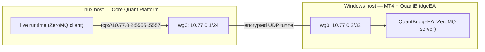

# WireGuard — private transport for remote Windows MT4 deployments

Architecture §29 / ADR-0025: the ZeroMQ channels between the Core Quant Platform and the
MT4 bridge (`OT_MT4_COMMAND_ADDR`, `OT_MT4_EVENTS_ADDR`, `OT_MT4_QUOTES_ADDR`) must never
be exposed to the internet. When MT4 runs on a separate Windows host, the only supported
transport is a WireGuard tunnel.

## Layout

```text
infra/wireguard/
├── README.md                  # this file
├── server/
│   └── wg0.conf.example       # Linux host running the Core (tunnel server)
└── peer/
    └── wg0-client.conf.example# Windows MT4 host (tunnel client)
```

## Topology



- The Core connects to `OT_MT4_COMMAND_ADDR=tcp://10.77.0.2:5555` etc. — the MT4
  peer's **tunnel** address, never a public IP.
- The Windows firewall allows only WireGuard's UDP port from the Core's public IP;
  ports 5555–5557 stay bound to the tunnel interface (`127.0.0.1`/tunnel on the MT4 host).
- `PersistentKeepalive` on the client keeps NAT mappings alive so the Core can always
  reach the EA.

## Setup

1. Generate keys (`wg genkey | tee private | wg pubkey > public`) for server and peer.
2. Fill `server/wg0.conf.example` with the peer's public key and the Core's public IP.
3. Fill `peer/wg0-client.conf.example` with the server's public key and endpoint.
4. Server: `sudo cp infra/wireguard/server/wg0.conf /etc/wireguard/ && sudo wg-quick up wg0`.
5. Windows peer: install WireGuard, import `wg0-client.conf`, activate.
6. Verify: `ping 10.77.0.2` from the Core; then point `OT_MT4_*_ADDR` at `tcp://10.77.0.2:*`.

## Hardening rules

- Never publish the ZeroMQ ports (5555–5557) to the internet or to a public interface;
  on the MT4 host bind them to the tunnel interface only.
- Rotate WireGuard keys on suspicion of compromise; treat the tunnel as a zone boundary,
  not a trust grant: the human approval gate and EA-side validations (symbol whitelist,
  lot limits, spread, quote freshness, duplicate order_intent_id, command expiry) still
  apply end-to-end (INV-5).
- Optional next step (threat T-16): CurveZMQ transport encryption between Core and EA;
  requires EA-side key support and is not part of this milestone.
